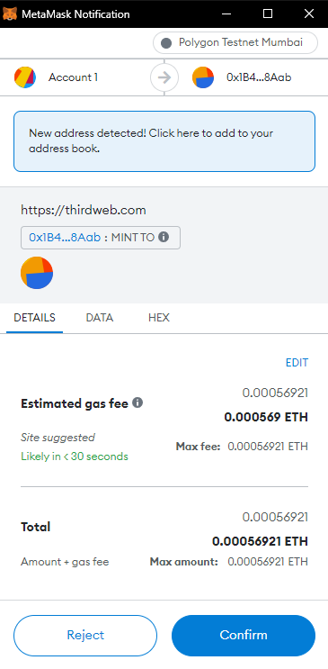

# Integrating the SDK

After you’ve deployed a contract using either the thirdweb dashboard or a thirdweb SDK, you can easily connect to your contract and access all of its functions to start using it within your application.

**Getting your contract using the thirdweb SDK**

```javascript
const nftCollection = useNFTCollection("your-contract-address-here");
```

Once you’ve got your contract, we’re ready to start using all of the SDKs capabilities to read and write data to it! Let’s see what we can do with our NFT Collection contract.

## Reading Data From Your Smart Contract

Our SDK handles all the complexity of loading data from your smart contracts and de-centralized storage such as IPFS. Let’s see how easy it is to read data from our NFT collection.

**View all the NFTs in your collection:**

Behind the scenes, the thirdweb SDK:

- **Provides** a loading flag to let us know when the data is ready
- **Fetches** the metadata of your NFTs from IPFS
- **Loads** the current owner of each NFT
- **Paginates** the results for easy consumption
- **Caches** the results for faster loading speeds
- **Formats** the result in an easy to use format

```jsx title="NftList.jsx"
// we assume you'll pass the nftCollection you accessed via the hook above into the component
const NftList = ({ nftCollection }) => {
  // Get all the NFTs within your smart contract
  const { data: nfts, isLoading } = useNFTs(nftCollection);

  //if we're still loading we will just render a loading div
  if (isLoading) {
    return <div>Loading nfts...</div>;
  }

  return (
    <ul>
      {nfts.map((nft) => (
        // we'll just render the name of each nft in the collection
        <li key={nft.metadata.id}>{nft.metadata.name}</li>
      ))}
    </ul>
  );
};
```

## Writing data to your smart contract

**Mint a new NFT into your collection:**

```jsx title="MintButton.jsx"
// we assume you'll pass the nftCollection you accessed via the hook above into the component
const MintButton = ({ nftCollection }) => {
  // access the mint nft hook by passing in your nftCollection
  const { mutate: mintNFT, isLoading: isMinting } = useMintNFT(nftCollection);
  // get the connected wallet address (we'll mint the NFT to the wallet that is connected)
  const connectedWalletAddress = useAddress();

  return (
    <button
      // disable the button while minting
      disabled={isMinting}
      onClick={() =>
        mintNFT({
          to: connectedWalletAddress,
          metadata: {
            name: "Test NFT",
            // ... other properties for the NFT
          },
        })
      }
    >
      {isMinting ? "Minting..." : "Mint NFT"}
    </button>
  );
};
```

**How our write operations work**

Any transaction that requires the approval of a signer will prompt the wallet to approve the transaction before any write operation is performed.

If you’ve ever used a web3 application before, this might be a familiar flow to you:

1. User is prompted to confirm the transaction
2. User confirms the transaction
3. User waits for the transaction to be written to the blockchain
4. User is notified when the transaction has successfully processed

All of our write operations in the SDK await the result of the transaction to be processed, (after step 4), so that you can use and display any of the details of the transaction you want.


