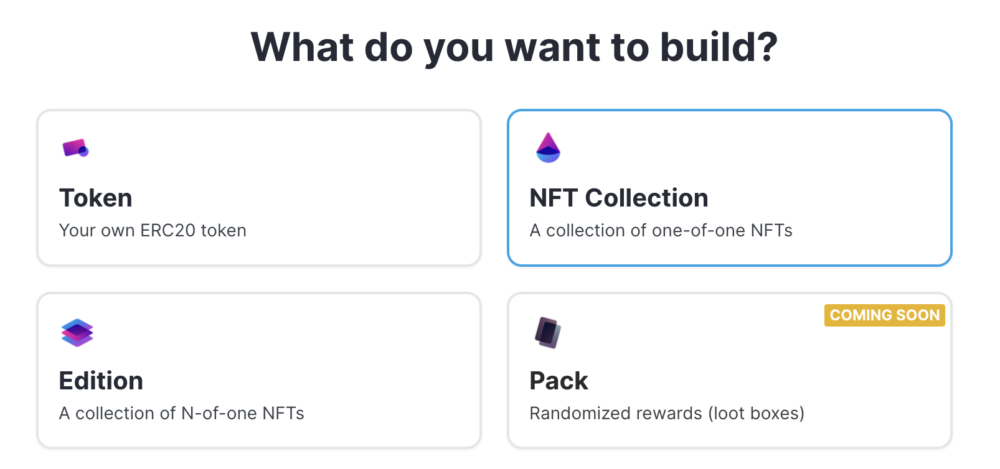
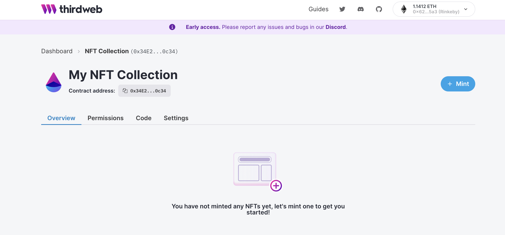

# NFT Collection

## In a nutshell

The **`NFT Collection`** is suited for cases where 1 media file is mapped to 1 token (NFT). In other words, you don't want to mint an NFT multiple times with the same asset (like an image).

If you're looking for a contract that can mint multiple NFTs based on the same asset (ERC-1155 standard), check out our `Edition` contract [here](/contracts/edition).

Perhaps you're looking to efficiently create and distribute 10k pfp style collections, then check out our `NFT Drop` contract [here](/contracts/nft-drop).

The **`NFT Collection`** contract is a smart contract, which is compliant with the ERC-721 standard. A thirdweb contract is actually more than _just_ a smart contract.

Click [here](/contracts) to learn more about contracts and how to create them.

## The settings

The following settings can be adjusted, when you create an **`NFT Collection`** contract:

- Name
- Description
- Image
- Symbol
- Royalty %

Once you've created the contract, you can adjust the following settings:

- Name
- Transfer Settings
- Description
- Image

## Use cases for NFT Collection

The following use cases are suited for the **`NFT Collection`** contract

1. Minting single (one of one) NFTs
2. List an NFT for sale on a [Marketplace](/contracts/marketplace) (you would also need the `Marketplace` contract for this)
3. Create a button in your app, that allows users to mint an NFT
4. Restricted transfer (check out this use case [here](/guides/make-your-nft-non-transferable))

## How it works

You can mint an NFT via the dashboard or SDK. When you mint an NFT, the connected wallet pays for the gas fees. If you mint it via the dashboard, your wallet pops up to confirm the transactions. If you mint via code, you won't see this explicit request to authorise the transaction.

After you execute the transaction to mint the NFT, we upload the image to **IPFS** for you and pin it, making sure that the integrity of the image is safeguarded.

Finally when the NFT is minted, you can see the NFT in your dashboard or call the metadata using our SDK via code.

## How to use the contract

You can use the `NFT Collection` contract with or without code:

1. TypeScript
2. Python
3. Dashboard Embed (our no-code solution)

### Setup your dev environment

To interact with your NFT Collection contract with code, you need to follow 3 steps:

1. Install the necessary packages on your (local) machine
2. Instantiate the SDK
3. Passing the address of the Contract inside your code

To install the necessary packages for TypeScript or Python on your (local) machine and instantiate the SDK in your code, check out [this](/guides/sdk-guide) guide to help you with that. Note, you can instantiate the SDK in multiple ways, so make sure to check out that guide.

You can find the contract address in the thirdweb dashboard or inside the `NFT Collection` contract itself.

## Code Guide

1. You can find the official TypeScript documentation [here](https://docs.thirdweb.com/typescript/sdk.nftcollection).
2. To check out guides for this contract click [here](/guides/nft-collection).
3. To setup your local dev environment, click [here](/guides/sdk-guide).
