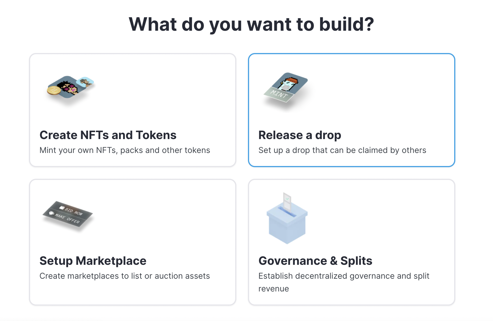
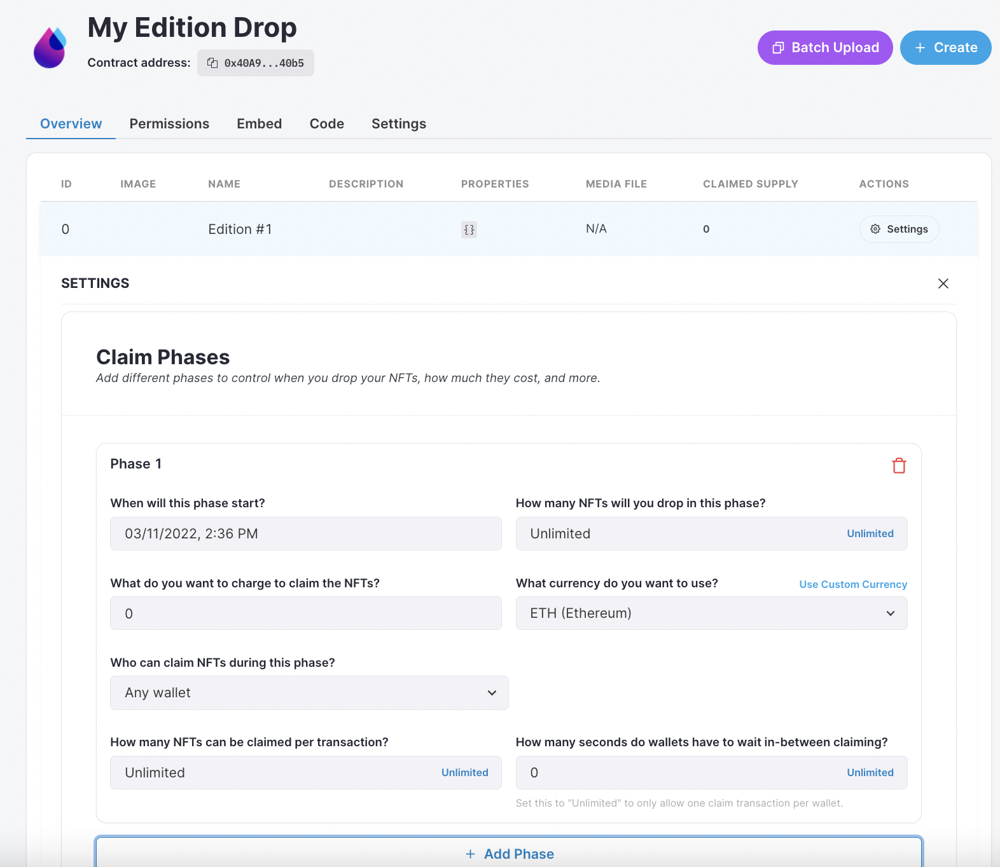
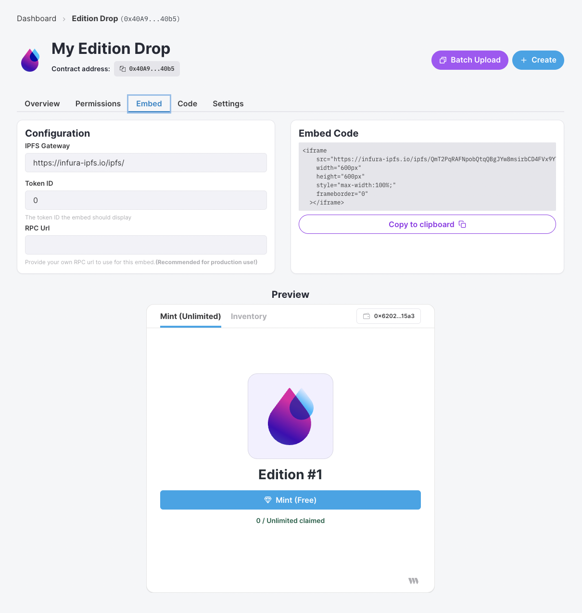
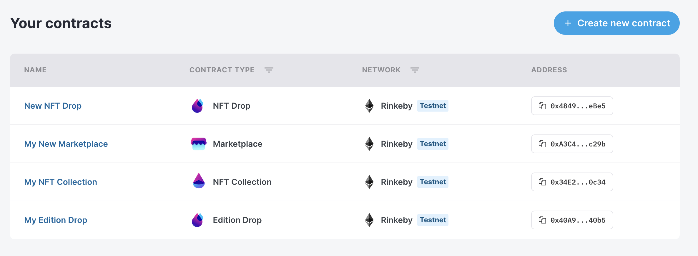

# Edition Drop

## In a nutshell

thirdweb's drop contracts lazy mints your NFT and makes it available to be claimed by your users. Lazy minting is when the creator defines conditions for a third party (your audience) to come in and mint the NFT. You choose what the underlying token is you want to distribute - it can be a 1-of-1 NFT or 1-of-many. Our **`Edition Drop`** contract gives you the mechanism to distribute your 1-of-many NFT.



Click [here](/contracts) to learn more about contracts and how to create them.

## How it works

Make sure you choose the right contract. If you want your drop to include 1-of-many NFTs, choose the **`Edition Drop`** contract. If you want to mint 1-of-1 NFTs, choose the `NFT Drop` contract [here](/contracts/nft-drop).

To be clear, when you create a drop inside your `Edition Drop` contract, the NFT is not minted yet. We prepare everything for your audience, so that they can mint it. The user who claims an NFT, mints it and transfers it to their wallet. By default the user pays the gas fees.

You can create a drop via the dashboard or our SDK. Once you've created a drop with the `Edition Drop` contract, the NFT does not show up in your wallet, but in a null address. The NFT is now ready to be claimed.

The claim conditions determine the rules for claiming an NFT over a period of time. The claim conditions have a different scope depending on the underlying contract. If you use an `Edition Drop` contract, you can set claim conditions **per NFT** (token ID).

If you use the `NFT Drop` contract, you can set claim conditions for **all NFTs** in the contract.


### Claim Phases

After uploading your NFT, you can set the claim conditions in the dashboard inside your **`Edition Drop`** token settings. This can also be done by code via the SDK. Some of the conditions you can set include:

1. The currency, meaning what the NFT should be payed in if there's a price to mint.
2. Price to claim each NFT
3. The max number of NFTs that are available to be claimed. It's possible you created more NFTs than you want people to claim.
4. The wait time between claims - 'Unlimited' means a wallet can only claim once
5. Number of claims per transaction - decides how many NFTs you can claim per transaction
6. Snapshot will allow you to include a list of `Allow-list` wallet addresses
7. Phase start time and date.

You can also set multiple phases up front - for example, your first phase can be for allowlist only minting, while your second phase is for public minting.



## Use cases for Edition Drop

The following use cases are suited for the **`Edition Drop`** contract:

1. Setup early access membership NFTs
2. Control over wallet addresses allowed to claim your NFTs
3. In game items with multiple owners
4. Restricted transfer (check out this use case with `Edition Drop` [here](/guides/make-your-nft-non-transferable))
5. Once NFTs are claimed they can be listed for sale on a Marketplace (you would also need the `Marketplace` contract for this)

### Our Embed feature

thirdweb developed an UI component for minting your NFTs. All you need to do is include the 'Embed Code' in your website. You can find this 👇 feature inside the dashboard under the tab `Embed` .



## How to use the contract

You can use the `Edition Drop` contract with or without code:

1. TypeScript
2. Python
3. Dashboard Embed (our no-code solution)

### Setup your dev environment

To interact with your Edition Drop contract with code, you need to follow 3 steps:

1. Install the necessary packages on your (local) machine
2. Instantiate the SDK
3. Passing the address of the Contract inside your code

To install the necessary packages for TypeScript or Python on your (local) machine and instantiate the SDK in your code, check out [this](/learn-thirdweb/connect-to-blockchain) guide to help you with that. Note, you can instantiate the SDK in multiple ways, so make sure to check out that guide.

You can find the contract address in the thirdweb dashboard, inside your project or inside the `Edition Drop` contract itself.



### Usage Examples

After you instantiate the SDK, you can use the `Edition Drop` contract with our SDK. Here's how to get the contract inside your code using typescript and claim one token.

```jsx
const editionDrop = sdk.getEditionDrop("<EDITION_DROP_ADDRESS>");
const tokenId = 0; // the id of the NFT you want to claim
const quantity = 1; // how many NFTs you want to claim

const claimNft = async () => {
  try {
    await editionDrop.claim(tokenId, quantity);
  } catch (err) {
    console.log(err);
  }
};

claimNft();
```

Here's an example of setting the claim conditions with code:

```jsx
const editionDrop = sdk.getEditionDrop("<EDITION_DROP_ADDRESS>");
const presaleStartTime = new Date();
const publicSaleStartTime = new Date(new Date() + 60 * 60 * 24 * 1000); // today's date + 24 hours
const allowList = ['0x...', '0x...'] // modify this with your allow list
const claimConditions = [
  {
    startTime: presaleStartTime, // start the presale now
    maxQuantity: 20, // limit how many mints for this presale
    price: 0.01, // presale price
    snapshot: allowList, // limit minting to only certain wallet addresses
  },
  {
    startTime: publicSaleStartTime, // 24h after presale, start public sale
    price: 0.08, // public sale price
  }
]);

const tokenId = 0; // the id of the NFT to set claim conditions on
const setClaimConditions = async () => {
  try {
    await editionDrop.claimConditions.set(tokenId, claimConditions);
  } catch (err) {
    console.log(err)
  }
}
setClaimConditions();
```

## Code Guide

1. You can find the official TypeScript documentation [here](https://docs.thirdweb.com/typescript/sdk.editiondrop).
2. To check out guides for this contract click [here](/guides/edition-drop).
3. To setup your local dev environment, click [here](/guides/sdk-guide).
