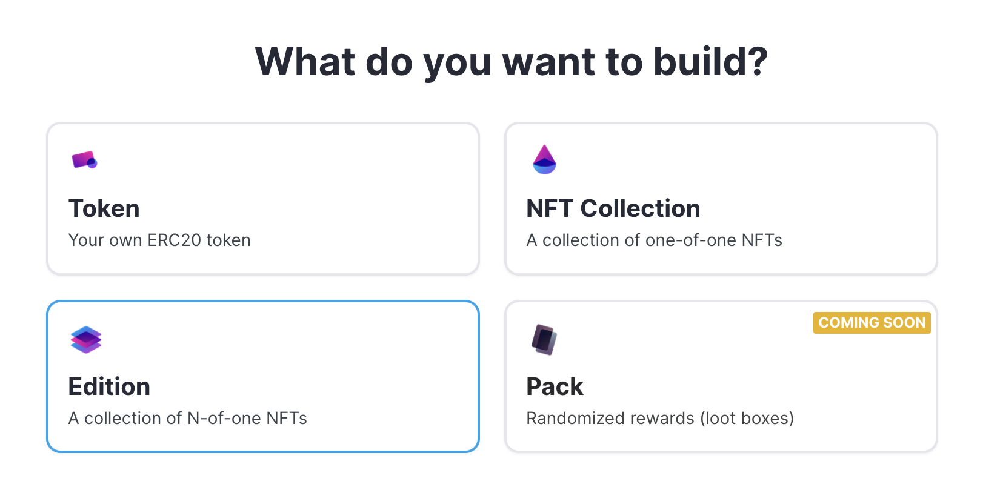
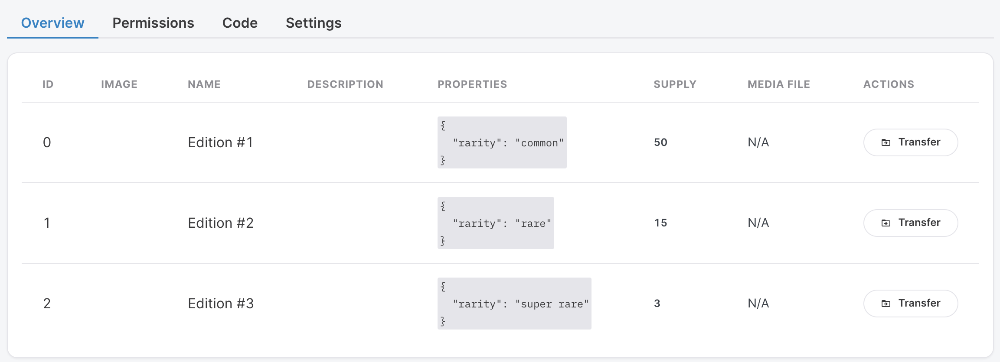
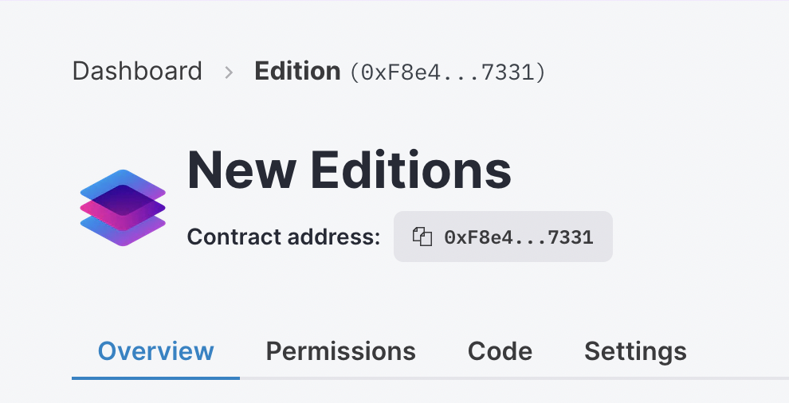

# Edition

## In a nutshell

With the `NFT Collection` contract, every NFT has an unique ID with an unique image. The **`Edition`** contract lets you mint multiple NFTs based on the same image or music file. Here's how that works👇

If you want to know more about creating contracts, click [here](/contracts).



## Mint your Edition NFT

With the **`Edition`** contract you can create an NFT and then pass a supply👇



Each of these NFTs👆share the same ID and same image, but now you can have multiple of these. This type of NFT is also called `one-of-many` with ERC-1155. Like this you can mint your own collection of NFTs. These NFTs can be listed for sale on any NFT platform or your own marketplace (created with thirdweb's `Marketplace` contract).

## How to use

You can create an **`Edition`** contract by using code or no-code. Head over to our dashboard to make use of the no-code solution. To use the code solution, you need to install our packages and instantiate our SDK first. Check out [this](/learn-thirdweb/connect-to-blockchain) page on how to do that. You'll also need the address of your `Edition` contract. You can find that on the dashboard or inside your contract.



### Examples

Here's an example on how to create an NFT in TypeScript:

```jsx
// The Edition contract address received after initializing the Edition contract on the dashboard.
const editionAddress = "<EDITION_ADDRESS>";
// Initialize the Edition contract with the address.
const edition = sdk.getEdition(editionAddress);
const mintNft = async (nft) => {
  try {
    await edition.mint(nft);
  } catch (error) {
    console.log(error);
  }
};
mintNft({
  name: "<NFT_NAME>",
  description: "<DESCRIPTION>",
  image: "<LINK>",
  attributes: "ATTRIBUTES_OBJECT OR ARRAY OF OBJECTS",
  initialSupply: "<INITIAL_SUPPLY_INT>",
});
```

## Code Guide

1. You can find the official TypeScript documentation [here](https://docs.thirdweb.com/typescript/sdk.edition).
2. To check out guides for this contract click [here](/guides/edition).
3. To setup your local dev environment, click [here](/guides/sdk-guide).
