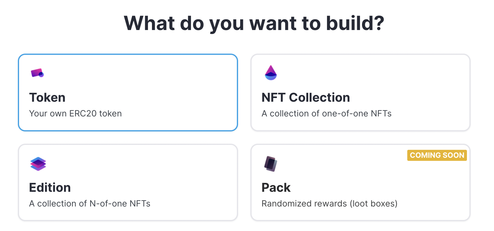
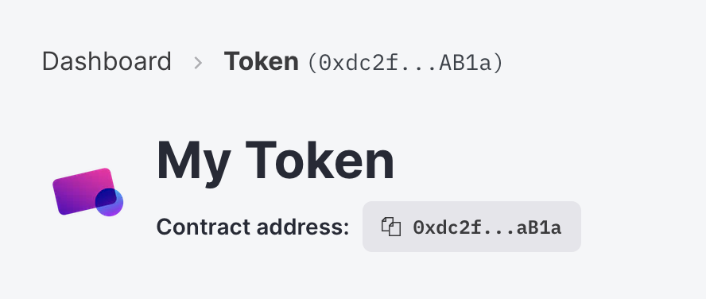

# Token

## In a nutshell

The **`Token`** contract is suited for projects in which you want to create your own currency. This currency can be purchased and traded between users on an exchange, utilized to buy and sell NFTs in a marketplace, and much more.

This can be combined with other contracts like `NFT Drop` , `Splits` , `Edition Drop` , and `Marketplace` for even greater functionality.

The **`Token`** contract is a smart contract, which is compliant with the ERC20 standard. A thirdweb contract is actually more than _just_ a smart contract.

Click [here](/contracts) to learn more about contracts and how to create them.



## The settings

The following settings can be adjusted, when you create an **`Token`** contract:

- Name
- Description
- Image
- Symbol (used to publicly identify your token)

## What can you do with our contract?

The following use cases are suited for the **`Token`** contract:

1. Offering the sale of a token or currency in your own marketplace or another exchange
2. Enable users to buy and sell NFTs within your marketplace
3. Give your community a share of voice using governance tokens
4. Restricted transfer (check out this use case with Edition Drop [here](/guides/make-your-nft-non-transferable))

## How it works

You can create your own token using the dashboard or SDK. When you mint tokens, the connected wallet pays for the gas fees. If you mint it via the dashboard, your wallet pops up to confirm the transactions. If you mint via code, you won't see this explicit request to authorize the transaction.

Once you've successfully minted your tokens, you can see the tokens in your dashboard or with the print/call function using the SDK.

## How to use the contract

You can use the **`Token`** contract with or without code:

1. TypeScript
2. Python
3. Dashboard Embed (our no-code solution)

### Setup your dev environment

To interact with your **`Token`** with code, you need to follow 3 steps:

1. Install the necessary packages on your (local) machine
   1. Ethers on typescript
   2. Dotenv / virtual-env
   3. Typescript / Python
   4. tslib when using Typescript
2. Instantiate the SDK
3. Passing the address of the contract inside your code

To install the necessary packages for TypeScript or Python on your (local) machine and instantiate the SDK in your code, check out [this](/guides/sdk-guide) guide to help you with that. Note, you can instantiate the SDK in multiple ways, so make sure to check out that guide.

You can find the contract address in the thirdweb dashboard, inside your project or inside the `Token` itself.



In order to make use of our SDK, you need to establish a connection to a blockchain. Click [here](learn/connect-to-blockchain) to learn how to connect to the blockchain and instantiate our SDK.

For this guide, you will need to instantiate the SDK following [these](/learn-thirdweb/connect-to-blockchain#using-your-own-signer-with-thirdweb) steps, using your own signer with thirdweb.

Here's an example of doing this in TypeScript👇

```jsx
// Instantiate Token contract
const token = sdk.getToken("<TOKEN_ADDRESS>");

// Create the function
const mintCurrency = async (amount) => {
  try {
    await token.mint(amount);
  } catch (err) {
    console.log(err);
  }
};

// Set the amount of currency you want to mint
const amount = "1000";
// Execute the function
mintCurrency(amount);
```

## Code Guide

1. You can find the official TypeScript documentation [here](https://docs.thirdweb.com/typescript/sdk.token).
2. To check out guides for this contract click [here](/guides/token).
3. To setup your local dev environment, click [here](/guides/sdk-guide).
