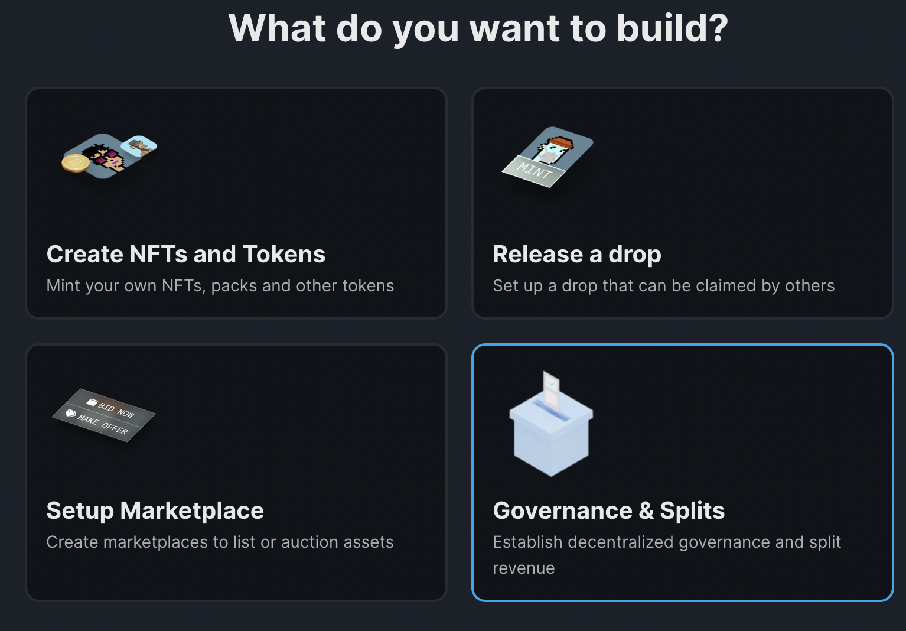
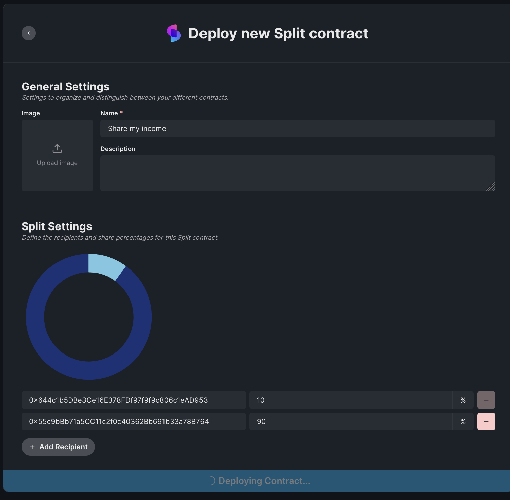
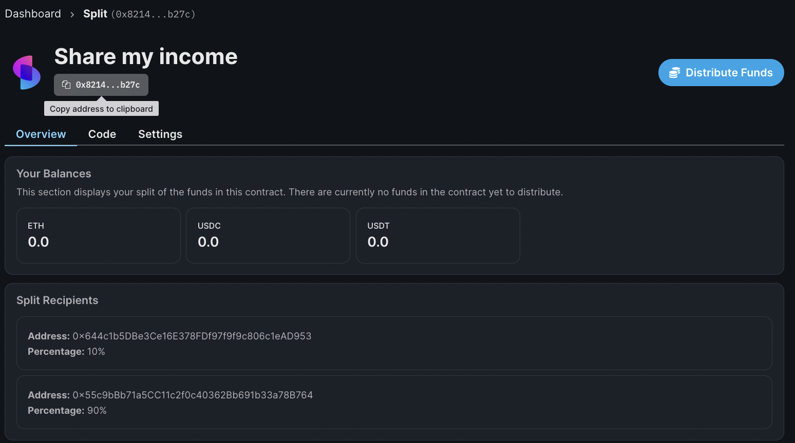
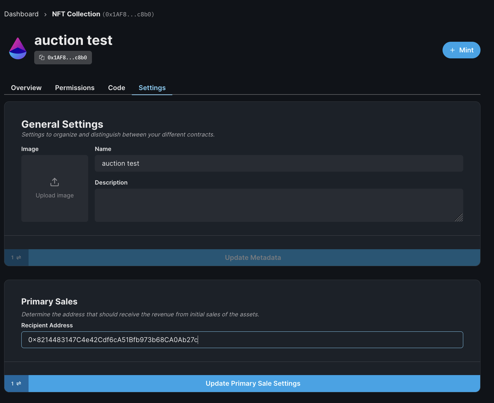

# Split

## In a nutshell

Introducing the **Split** contract, which lets you easily create a royalty split to securely hold and distribute funds.
You can use it to store any funds by sending funds directly to the contract, plugging it in as the recipient address of other contracts, or any other way that you can send funds to a standard wallet.

## How it works

Think of the split contract as a fully customizable decentralized treasury. You can use the split contract to receive and send funds by interacting with other contracts.
The split contract lets you specify (multiple) wallets who are recipients of any revenue or royalty split. Based on the split per wallet, the funds are distributed accordingly.
This contract also has the ability to hold native currencies (ETH and MATIC) and any ERC-20 tokens.

## What can you do with our contract?

The following use cases are suited for the Split contract:

1. You are working with a team and need to split funds on chain
2. Share revenue from our primary minting sales with others
3. Share revenue from our royalty sales with others
4. Any programmatic split of revenue

## Setting up your Split contract

You can create a **Split** contract from the thirdweb dashboard. Go ahead and click on `Create new contract`.

The Split contract can be found under Governance.

Add all the relevant wallet addresses to the contract. Please note, the total allocation needs to add up to a 100%.

After you created the contract, copy the address and use it in any other contract you want.

Here's an example on how to use the split contract inside an existing NFT Collection contract.
Go to the settings inside your NFT Collection contract.

Enter the address of the split contract under either the `Primary Sales`, `Royalty recipient` or both.
Now after any sale, parties in the split contract will benefit from the primary sale. If you also entered the address of the split contract under `Royalty Recipient`, then the same goes for any secondary sales.

For a full guide on setting up your Split contract on your NFT Drop, check [this](/guides/nft-drop-with-revenue-share) out.

## Code Guide

1. You can find the official TypeScript documentation [here](https://docs.thirdweb.com/typescript/sdk.split).
2. To check out guides for this contract click [here](/guides/split).
3. To setup your local dev environment, click [here](/guides/sdk-guide).
