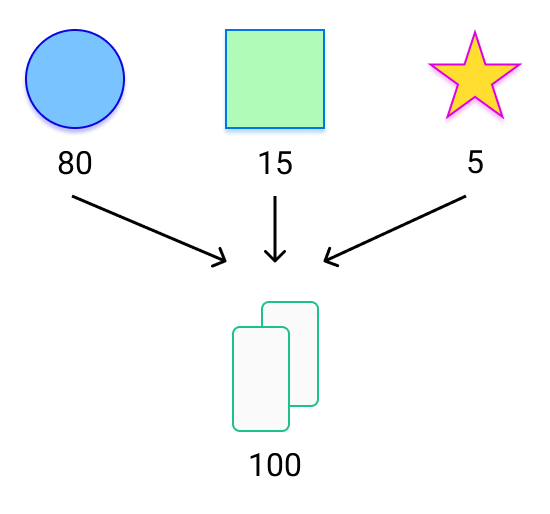
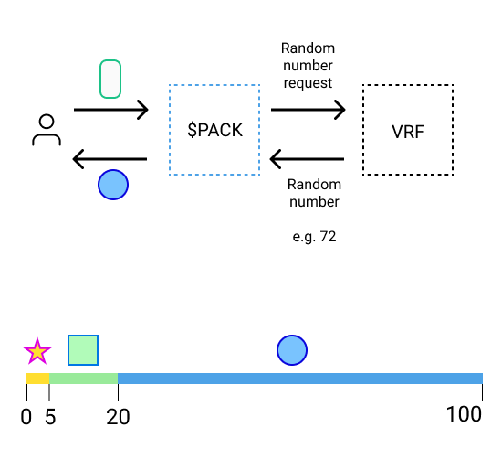

# Pack

## Protocol

The protocol has three primitives - coins, NFTs and packs. In this section, we describe one of those - packs (as the **Pack** component). The protocol lets you create n number of Pack components.

The **Pack** component provides a flexible 'lootbox' API. Packs can contain arbitrary crypto assets as items - exclusive NFTs to ERC 20 tokens. A pack can be opened in exchange for one or more of the items packed within. The chance of receiving a particular item depends on how rare the item is.

## In a nutshell

Packs are designed to work as generic packs that contains items in them, where a pack can be 'opened' to retrieve the items in that pack. Packs like these already exist as e.g. regular [Pokemon card packs](https://www.pokemoncenter.com/category/booster-packs), or in other forms that use blockchain technology, like [NBA Topshot](https://nbatopshot.com/) packs.

Packs are [ERC 1155](https://eips.ethereum.org/EIPS/eip-1155#motivation) tokens. Adopting the ERC 1155 token standard for packs allows the protocol to create different kinds of packs, where each kind of pack is individuated by a unique set of underlying items, and has it's own independent supply.

A fixed supply of packs is created when someone creates packs with a set of underlying items. The total amount of packs created is equal to the sum of the amounts of each kind of item it contains. For example, if someone creates packs with three underlying items - packing an amount 5, 15 and 80 of each - a total of 100 packs are created.

The protocol assigns each new set of packs created in this way, with a unique integer token ID.

The supply of packs decreases when packs are opened in exchange for one of the pack's items. Packs are burned when they are opened; they can be opened only one at a time.

Packs 1-1 represent their underlying items, which guarantees the receipt of an item on opening a pack.

### Simple example

Let's create a set of packs with three kinds of items - 80 **circles**, 15 **squares**, and 5 **stars**. The number of packs created is equal to the sum of the supplies of each item. So, we now have `80 + 15 + 5` i.e. 100 packs at hand.

On opening one of these 100 packs, the opener will receive one of the pack's items - either a **circle**, a **square**, or a **star**. The chances of receiving a particular item is determined by how many of that item exists across our set of packs. The chances of receiving a particular item are calculated as:

`(number of items packed ) / total number of packs`

In the beginning, 80 **circles**, 15 **squares**, and 5 **stars** exist across our set of 100 packs. That means the chances of receiving a **circle** upon opening a pack is `80/100` i.e. 80%. Similarly, a pack opener stands a 15% chance of receiving a **square**, and a 5% chance of receiving a **star** upon opening a pack.

The chances of receiving each kind of item change as packs are opened. Let's say one of our 100 packs is opened, yielding a **circle**. We then have 99 packs remaining, with 79 **circles**, 15 **squares**, and 5 **stars** packed.

For the next pack that is opened, the opener will have a `79/99` i.e. around 79.8% chance of receiving a **circle**, around 15.2% chance of receiving a **square**, and around 5.1% chance of receiving a **star**.

### Rarity of items

What determines how rare a particular item is, boils down to how many of those items exist in total. The total amount of a kind of item that exists across a set of packs determines the % chances of receiving that kind of item on opening a pack.

For the set of 100 packs with three kinds of items - 5, 15 and 80 of each across that set of packs - there's a `5/100` i.e. 5%, 15% and 80% chance, respectively, of receiving that item on opening a pack.

### How an item is selected for distribution when a pack is opened

We shall extend the above 'Simple example' of a set of 100 packs with three kinds of items - 80 **circles**, 15 **squares**, and 5 **stars**.

The supply of the items in this set of packs - 80 **circles**, 15 **squares**, and 5 **stars** - can be represented on a number line, from zero to the total supply of packs - in this case, 100.

Whenever a pack is opened, the protocol uses a new random number in the range of the total supply of packs to determine what item will be distributed to the pack opener.

In our example case, the protocol uses a random number less than 100 to determine whether the pack opener will receive a **circle**, **square** or a **star**. So e.g. if the random number num is such that `0 <= num < 5`, the pack opener will receive a **star**. Similarly, if `5 <= num < 20`, the opener will receive a **square**, and if `20 <= num < 100`, the opener will receive a **circle**.

Note that given this design, the opener truly has a 5% chance of receiving a **star**, a 15% chance of receiving a **square**, and an 80% chance of receiving a **circle**.

### Sourcing a random number for item distribution

The protocol uses a new random number each time a pack is opened.
For the item distribution to be fair and solely based on the rarity of items, the random number used on the opening of a pack must be 'truly random' - neither manipulable by the pack opener, nor knowable to the opener before opening the pack.
To this end, the protocol uses [Chainlink VRF (Verifiable Random Function)](https://docs.chain.link/docs/chainlink-vrf/) to source random numbers.

Chainlink VRF is a random number generator that operates on a request ←→ response model, where a smart contract can request a random number from the Chainlink VRF system in one transaction, and the Chainlink VRF system fulfills that request in a subsequent transaction with a random number.

When a pack is opened, the protocol requests Chainlink VRF for a new random number, which then determined which item is distributed to the pack opener.
